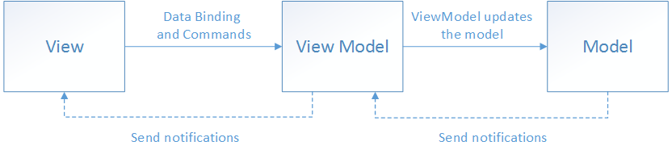

# Directory Structure

Iris was created using the Model-View-ViewModel (MVVM) architecture. All code is stored in the `./lib/` directory.

## Models

Models are the underlying structures which hold data that make up the objects in the program. These are stored in `./lib/models/`

## ViewModels

ViewModels expose the data stored within Models to the Views. ViewModels handle much of the logic of the program. These are stores in `./lib/viewmodels/`

## Views

Views do not contain any major logic. Instead Views call to ViewModels to expose data from Models and run logic. Views exclusively display information to the user. These are stored in `./lib/views/`

## Other Directories

Other directories within `./lib/` store helpers to assist the Models, Views, and ViewModels while maintaining clean code structure. The files in these directories adhere tp the MVVM structure.
